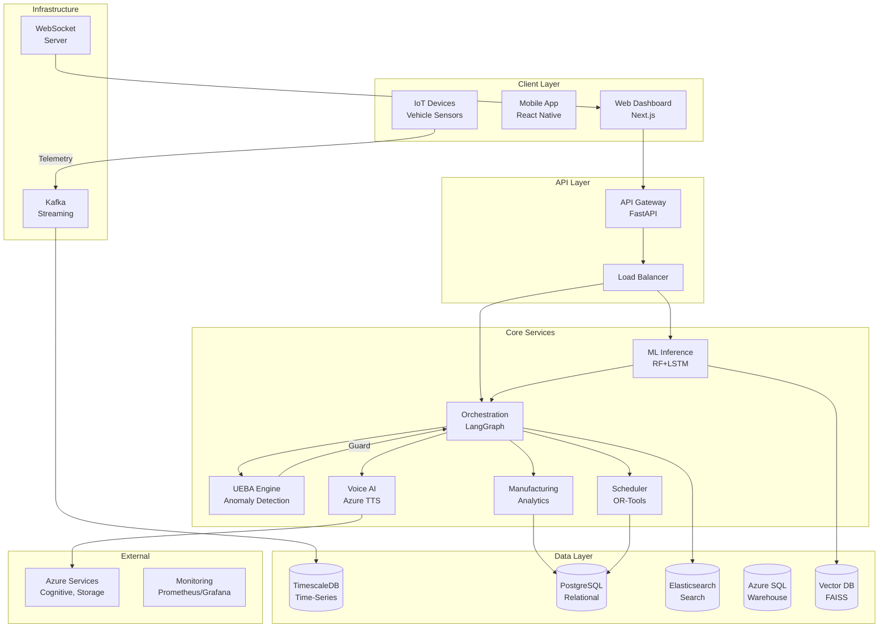

# System Architecture Design Prompt

## Prompt for AI/Diagramming Tools

Create a professional, production-grade system architecture diagram for an **Agentic AI-Driven Predictive Maintenance & Quality Intelligence Platform** that fits perfectly in a 16:9 slide format. The diagram should be clear, well-organized, and suitable for technical presentations.

### System Overview
Design a comprehensive architecture showing a real-time predictive maintenance platform with AI agents, hybrid ML models, and multi-dimensional analytics.

### Core Components to Include:

#### 1. **Client Layer** (Top)
- **Web Dashboard**: Next.js frontend (React/TypeScript)
- **Mobile App**: React Native (optional, show as dashed box)
- **IoT Devices**: Vehicle telemetry sensors (edge devices)

#### 2. **API Gateway & Load Balancer** (Below Clients)
- **API Gateway**: FastAPI with rate limiting, authentication
- **Load Balancer**: Distributes traffic across backend instances

#### 3. **Backend Services Layer** (Main Section - Horizontal Layout)
- **Orchestration Service**: LangGraph-based agent orchestrator
  - Master Agent (routing)
  - Worker Agents (Data Analysis, Diagnosis, Voice, Scheduling, Feedback, Manufacturing)
  - Shadow Safety Twin (decision comparison)
- **ML Inference Service**: Hybrid RF + LSTM model serving
- **UEBA Engine**: User & Entity Behavior Analytics (Isolation Forest + Intent Graph)
- **Scheduling Optimizer**: OR-Tools based maintenance scheduling
- **Voice AI Service**: Azure TTS + Whisper STT + Sentiment Analysis
- **Manufacturing Analytics**: KMeans clustering + RCA/CAPA engine

#### 4. **Data Layer** (Bottom Section)
- **Time-Series DB**: TimescaleDB (telemetry, sensor data)
- **Relational DB**: PostgreSQL (maintenance records, RCA/CAPA)
- **Document Store**: Elasticsearch (logs, UEBA events, audit trails)
- **Data Warehouse**: Azure SQL (historical analytics, reporting)
- **Vector DB**: FAISS/Chroma (knowledge base, embeddings)

#### 5. **Message Queue & Streaming** (Between Services and Data)
- **Apache Kafka**: Real-time telemetry streaming
- **WebSocket Server**: Live dashboard updates

#### 6. **ML/AI Infrastructure** (Side Section)
- **Model Training Pipeline**: Batch training jobs (RF + LSTM)
- **Model Registry**: Versioned model artifacts
- **Feature Store**: Pre-computed features for inference

#### 7. **External Services** (Right Side)
- **Azure Cognitive Services**: Speech-to-Text, Text-to-Speech
- **Cloud Storage**: Azure Blob (model artifacts, heatmaps)
- **Monitoring**: Application Insights, Prometheus, Grafana

#### 8. **Security & Governance** (Perimeter)
- **UEBA Guard**: Blocks risky agent actions
- **API Authentication**: OAuth2/JWT
- **Network Security**: VPC, Firewall rules
- **Audit Logging**: All agent decisions logged

### Data Flow Arrows (Show Direction):
1. **IoT → Kafka → TimescaleDB** (telemetry ingestion)
2. **Telemetry → ML Inference → Orchestration** (risk scoring flow)
3. **Orchestration → Worker Agents → External Services** (agent actions)
4. **Agents → UEBA Guard → Decision** (safety checks)
5. **Manufacturing Events → Analytics → PostgreSQL** (RCA/CAPA)
6. **All Services → Elasticsearch** (audit logging)

### Visual Style Requirements:
- **Color Scheme**: 
  - Blue: Data/Storage components
  - Green: ML/AI components
  - Orange: Services/APIs
  - Purple: Security/Governance
  - Gray: Infrastructure
- **Layout**: Top-to-bottom flow (Clients → APIs → Services → Data)
- **Grouping**: Use containers/boxes to group related components
- **Labels**: Clear, concise component names
- **Icons**: Use standard cloud/tech icons where appropriate
- **Legends**: Include a small legend for component types

### Key Relationships to Highlight:
- **Real-time path**: IoT → Kafka → ML → Orchestration → Actions
- **Batch path**: Historical data → Training → Model Registry → Inference
- **Feedback loop**: Manufacturing defects → Analytics → CAPA → Back to production
- **Safety path**: Agent decision → UEBA Guard → Approval/Block

### Text Annotations (Optional):
- Add small callouts for:
  - "Hybrid ML: RF (pattern) + LSTM (temporal)"
  - "LangGraph: Stateful agent orchestration"
  - "Shadow Twin: Safety validation"
  - "UEBA: Anomaly detection + intent monitoring"

### Slide Format:
- **Aspect Ratio**: 16:9 (1920x1080 or similar)
- **Margins**: Leave 10% margin on all sides
- **Font Size**: Minimum 10pt for readability
- **Component Size**: Consistent, proportional sizing
- **Spacing**: Adequate whitespace between components

### Output Format:
Generate as a high-resolution image (PNG/SVG) suitable for presentation slides, with clear labels and professional styling.

---

## Alternative: Mermaid Diagram Code

If using Mermaid or similar tools, use this structure:

---

## Usage Instructions

1. **For ChatGPT/Claude/DALL-E**: Copy the "Prompt for AI/Diagramming Tools" section and ask to generate the architecture diagram
2. **For Draw.io/Lucidchart**: Use the component list and relationships to manually create
3. **For Mermaid**: Use the Mermaid code in tools like Mermaid Live Editor or GitHub
4. **For Excalidraw**: Use the structure as a guide for freehand drawing

---

## Customization Notes

- Adjust component names to match your actual implementation
- Add/remove components based on your specific needs
- Modify color scheme to match your brand
- Add specific technology versions if needed (e.g., "Python 3.11", "Next.js 14")

